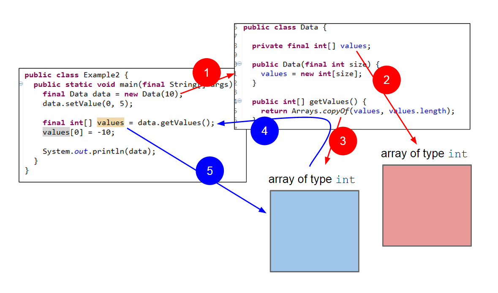

Rubik's cube ([Wiki](http://en.wikipedia.org/wiki/Rubik's_Cube)) is quite tough to solve especially for someone inexperienced like myself.  Let say for example, you spend a couple of hours solving a given Rubik''s cube and once solved, you give it to one of your friends to see.  Nothing prevents your friend, to whom you trusted your solved Rubik's cube, from reshuffle it and thus losing all your efforts.   Something similar can happen within an application program where objects are shared with other objects (referred as recipients) and the former are unintentionally (or intentionally) modified by the latter, causing unexpected behaviour.

Defensive copying is a technique which mitigates the negative effects caused by unintentional (or intentional) modifications of shared objects.  As the title indicates, instead of sharing the original object, we share a copy of it and thus any modification made to the copy will not affect the original object.

All code listed below is available at: [https://github.com/javacreed/what-is-defensive-copying](https://github.com/javacreed/what-is-defensive-copying).  Most of the examples will not contain the whole code and may omit fragments which are not relevant to the example being discussed.  The readers can download or view all code from the above link.

The article starts by introducing a problem and then it provides a method to address such problem using the defensive copying technique.  Finally it suggests another technique, that too can be used to address similar problems, and compares the effectiveness of both techniques.

## Problem

Consider the following class.

```java
package com.javacreed.examples.oop.part1;

import java.util.Arrays;

public class Data {

  private final int[] values;

  public Data(final int size) {
    values = new int[size];
  }

  public int[] getValues() {
    return values;
  }

  public void setValue(final int index, final int value) throws IllegalArgumentException {
    if (value < 0) {
      throw new IllegalArgumentException("The value must be positive");
    }

    values[index] = value;
  }

  @Override
  public String toString() {
    return Arrays.toString(values);
  }
}
```

The `Data` class shown above is quite simple.  It has one field (also referred to property) of type `int[]` (integer array), whose length is defined at the constructor.  The elements of this fields can be modified through the `setValue()` method which validates the input and throws an `IllegalArgumentException` ([Java Doc](http://docs.oracle.com/javase/7/docs/api/java/lang/IllegalArgumentException.html)), if the given value is negative as shown the following fragment.

```java
  public void setValue(final int index, final int value) throws IllegalArgumentException {
    if (value < 0) {
      throw new IllegalArgumentException("The value must be positive");
    }

    values[index] = value;
  }
```

Therefore, the above method does not accept negative values and thus the following example will fail when executed.

```java
package com.javacreed.examples.oop.part1;

public class Example1 {
  public static void main(final String[] args) {
    final Data data = new Data(10);
    data.setValue(0, 5);

    /* This will fail as you cannot set negative numbers */
    data.setValue(0, -10);
  }
}
```

As anticipated before, the above example will throw an exception as shown next.

```
Exception in thread "main" java.lang.IllegalArgumentException: The value must be positive
	at com.javacreed.examples.oop.part1.Data.setValue(Data.java:40)
	at com.javacreed.examples.oop.part1.Example1.main(Example1.java:30)
```

Unfortunately there is a way to bypass the validation process and set negative values as we will see next.  Consider the following example.

```java
package com.javacreed.examples.oop.part1;

public class Example2 {
  public static void main(final String[] args) {
    final Data data = new Data(10);
    data.setValue(0, 5);

    final int[] values = data.getValues();
    values[0] = -10;

    System.out.println(data);
  }
}
```

The above program retrieves the array of integers using the `getValues()` method.  This method returns a reference to the same array (object instance) that the instance of `Data` has.  Therefore, any changes to the returned array will affect the same array contained within the instance of the `Data` class.  In other words, instead of using the `setValue()` method, and pass through the proper channels, we can modify the array's content directly.

The above program runs without any errors and produces the following output

```
[-10, 0, 0, 0, 0, 0, 0, 0, 0, 0]
```

Despite our validation, the first element of the array is negative.  This means that we are able add negative values and thus bypassing all implied validations or security measures.  While the example used here is kept very basic in order to focus on the problem, the implications of such scenario can be quite drastic.  Tests on the `setValue()` will not reveal any weaknesses in this regards and the developers that are not aware of such problem may not realise that the issue is elsewhere.  In fact, the `setValue` is not to blame here.  This issue is caused by the simplest method of them all, the `getValues()` method.

The `getValues()` is allowing the field `values` to escape as shown in the following image.  When a method returns a field, like this one, this field (or better the object to which this field refers) is said that "it escaped" as now it is shared with other code (the recipient code), which code has direct access to the array as shown in the following image.


Let us understand well what is happening here.

1. A new instance of the `Data` class is created.  This instance can be accessed through the variable `data`.

1. When an instance of the `Data` class is created, an array of integers is created too.  The array, which is an object in Java, can be accessed through the `values` field within the `Data` class.

1. The `getValues()` methods returns a reference (or a pointer) to the same object that the field `values` is referring to.

1. The integer array object has now escaped the object of type `Data` as it can be accessed following two (or more) paths as shown in red and blue below.

    

This problem is also said to break encapsulation ([Wiki](http://en.wikipedia.org/wiki/Encapsulation_(object-oriented_programming))), as fields that were meant to be controlled by the enclosing class, have escaped and can be accessed directly by the recipient code.  Note that this is not always a bad thing and there are valid cases where you want this to happen.

This section introduced a problem where objects are modified in an uncontrolled manner.  In the next section we will see how to address this problem by using the defensive copying technique.

## Defensive Copying

Defensive copying is a technique where an identical, but disconnected, copy of an object (including arrays) is returned instead of the original one (similar to a deep copy - [Wiki](http://en.wikipedia.org/wiki/Object_copy)).  Thus any modification to the returned object will not affect the original object.

Instead of returning a reference to the object referred to by the field named `values`, we return a copy instead as shown in the following example.

```java
package com.javacreed.examples.oop.part2;

import java.util.Arrays;

public class Data {

  public int[] getValues() {
    return <span class="highlight">Arrays.copyOf(values, values.length)</span>;
  }

  /* Methods removed from brevity */
}
```

The `Arrays` ([Java Doc](http://docs.oracle.com/javase/7/docs/api/java/util/Arrays.html)) class provides a simple way to create a copy of an array which is independent from the original array.



As shown in the above image, now we have two copies (one shown in red and the other in blue).  The one in red, represents the integer array held by the instance of `Data`.  The other one, the one in blue, is the copy returned to the recipient.  As you can see, the field `values` is not escaping anymore as we are now returning a copy instead.  Therefore any changes to the returned integer array elements (similar to those we made before) will not affect the original one as shown in the following example.

```java
package com.javacreed.examples.oop.part2;

public class Example1 {
  public static void main(final String[] args) {
    final Data data = new Data(10);
    data.setValue(0, 5);

    final int[] values = data.getValues();
    values[0] = -10;

    System.out.println(data);
  }
}
```

In the above example we are trying to replicate the original problem where we modify the returned object directly rather than going through the `setValue()` method.  This will have no effect on the original array and the above program will not print negative values as shown next.

```
[5, 0, 0, 0, 0, 0, 0, 0, 0, 0]
```

As we saw in the above result, defensive copying addressed our problem.  Changes made to the returned array do not affect the original one, and thus we can be sure that all values changes must go through the `setValue()` method.

Should we always use defensive copying?  The answer is <strong>NO</strong>.  As mentioned before, there can be cases where you want to share objects.  But you need to do this consciously and be aware about the consequences.  Defensive copying is not cheap, in terms of memory.  Every time the `getValues()` method is called a new array is created.  This can have a negative impact on the application performance as it may generate many objects which the garbage collector needs to clean.  

This section showed that by returning a copy, we can safeguard against unwanted modifications by other objects.  In the next section we will discuss another solution that can too help us address this problem.

## Fields Types

In the previous section we discussed the `Data` class, which class has one field.  The field was of type integer array and the issue we saw was related to modifying the array elements directly instead through the enclosing class.  Why I am saying this?  The field type was pick on purpose.  If the array was immutable, that is, it was not possible to modify it ([Wiki](http://en.wikipedia.org/wiki/Immutable_object)), then we would have no issue.  Unfortunately Java does not support immutable, or read-only, arrays.  If instead of arrays, we store the values into a `List` ([Java Doc](https://docs.oracle.com/javase/7/docs/api/java/util/List.html)), then we can return an immutable copy of the list.  In other words, we will have two lists.  One that can be modified, and another one that cannot, and both lists are backed by the same data.  The set method will operate on the modifiable one, while the get method will return the unmodifiable one.  This approach will save us from creating a new array every time the `getValues()` method is invoked.  

The following example shows the new version of the `Data` class.

```java
package com.javacreed.examples.oop.part3;

import java.util.ArrayList;
import java.util.Collections;
import java.util.List;

public class Data {

  private final List<Integer> values = new ArrayList<>();
  private final List<Integer> immutableValues = Collections.unmodifiableList(values);

  public List<Integer> getValues() {
    return immutableValues;
  }

  public void addValue(final int value) throws IllegalArgumentException {
    if (value < 0) {
      throw new IllegalArgumentException("The value must be positive");
    }

    values.add(value);
  }

  @Override
  public String toString() {
    return String.valueOf(values);
  }
}
```

Two lists replaced the single array of integers.  The class was modified a bit to accommodate the use of lists over arrays.  For example, we replaced the `setValue()` method with the `addValue()` method.  But in essence this class serves the same purpose.

As we did before, we will attempt to modify the list of integers through the `getValues()` as we did before.

```java
package com.javacreed.examples.oop.part3;

import java.util.List;

public class Example1 {
  public static void main(final String[] args) {
    final Data data = new Data();
    data.addValue(5);

    final List<Integer> values = data.getValues();
    values.set(0, -10);

    System.out.println(data);
  }
}
```

The above example will compile but will fail at runtime with an `UnsupportedOperationException` ([Java Doc](https://docs.oracle.com/javase/7/docs/api/java/lang/UnsupportedOperationException.html)) as shown next.

```
Exception in thread "main" java.lang.UnsupportedOperationException
	at java.util.Collections$UnmodifiableList.set(Collections.java:1213)
	at com.javacreed.examples.oop.part3.Example1.main(Example1.java:32)
```

The inner class `UnmodifiableList` ([Java Doc](https://docs.oracle.com/javase/6/docs/api/java/util/Collections.html#unmodifiableList(java.util.List))) will throw an `UnsupportedOperationException` when any of the mutable methods, such as `add()` or `set()` are invoked.  This guarantees that the recipient code will not modify the list while it shares any modifications made as shown next.

```java
package com.javacreed.examples.oop.part3;

import java.util.List;

public class Example2 {
  public static void main(final String[] args) {
    final Data data = new Data();
    final List<Integer> values = data.getValues();

    data.addValue(5);

    System.out.println(data);
    System.out.println(values);
  }
}
```

The above code will produce the following to the output

```
[5]
[5]
```

Any changes made to the mutable copy of the list (the fields named `values`) will reflect on the immutable one (the fields named `immutableValues`).

In this section we saw an alternative way to protect against unwanted modifications.  This approach can prove more memory efficient when compared to defensive copying as it uses the same copy instead of creating a new one every time.  Furthermore, the recipients can still get all changes made to the backing list without having to call the `getValues()` method again.   

One thing to take from this section is that when possible choose immutable fields over mutable ones, such as `long` ([Tutorial](https://docs.oracle.com/javase/tutorial/java/nutsandbolts/datatypes.html)) over `Date` ([Java Doc](https://docs.oracle.com/javase/7/docs/api/java/util/Date.html)).  This is not always possible but such small decisions can make the code safer and immune to unintentional modifications.

## Conclusion

Defensive copying helps encapsulation as it mitigates escape of fields through the getters methods.  Defensive copying creates a copy every time and thus you can end up with too many copying of something.  This can strain the memory management (the garbage collector) and can have a negative effects on the whole application performance.  With that said, it is quite effective and simple to implement.  Prevention is better than cure, but in cases where we cannot change the types, defensive copying can step in and save the day.
